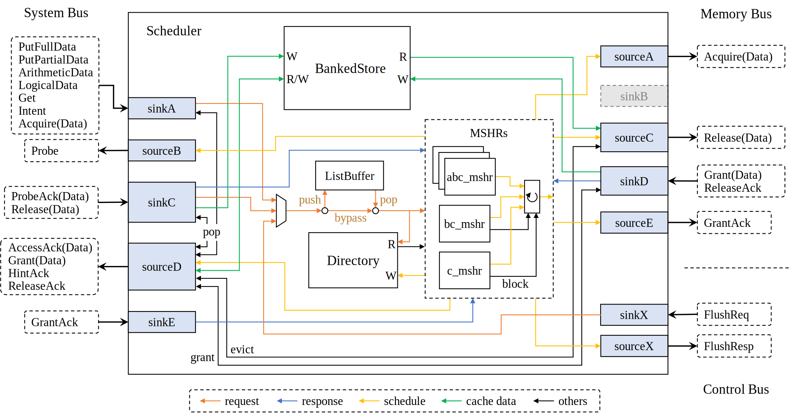
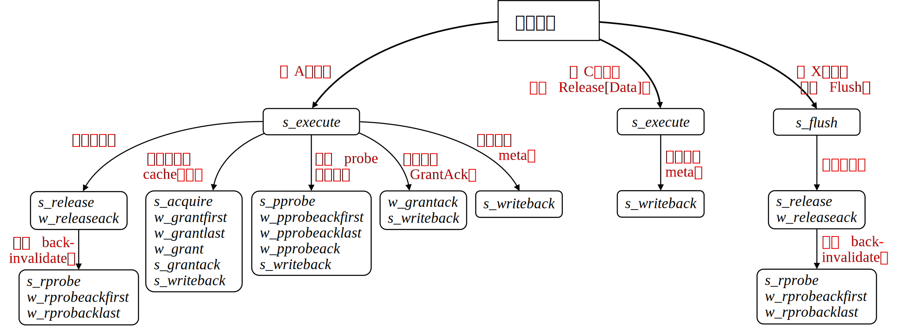
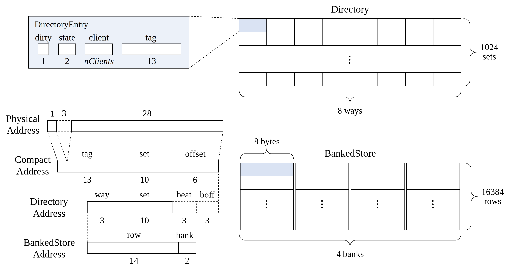
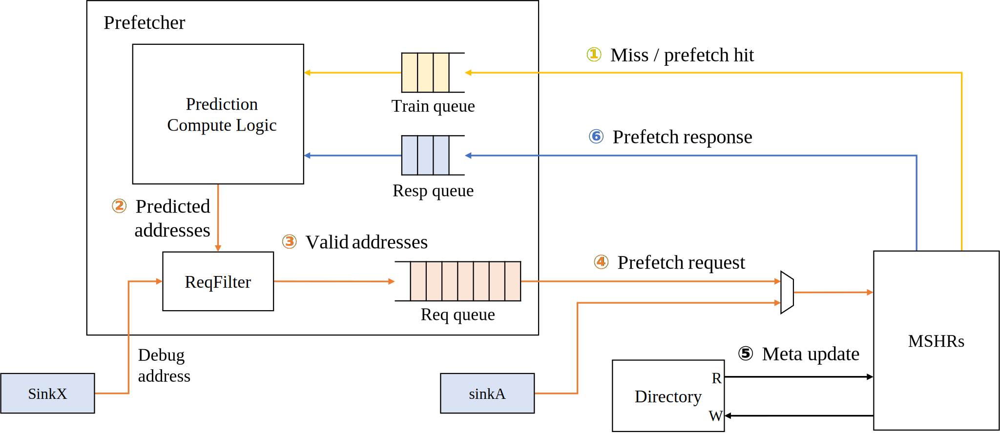

在SiFive Inclusive Cache上实现预取
===

## 原理
### Scheduler

### MSHR状态分支逻辑

### Directory和BankedStore的存储方式

### 预取接口

## 使用方法
使用方法已经放在另一个仓库里了，见[使用带预取功能的L2](https://github.com/lshpku/l2proj#%E4%BD%BF%E7%94%A8%E5%B8%A6%E9%A2%84%E5%8F%96%E5%8A%9F%E8%83%BD%E7%9A%84l2)
